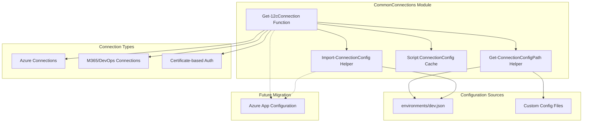

# CommonConnections Module Architecture

## Project Overview
The CommonConnections module provides centralized connection management capabilities for OrchestratorPsh scripts and modules by reading JSON configuration files and exposing connection details through a simple API.

## System Architecture
A PowerShell module that reads JSON configuration files containing Azure, M365, and certificate-based connection details, and provides a unified interface for accessing these connection properties with built-in caching and error handling.

## Technology Stack
- PowerShell 5.1+
- JSON configuration parsing
- Module-scoped caching
- Error handling and fallback mechanisms

## Modules and Components

- **Get-12cConnection**: Main function that retrieves connection details with optional property-specific access and custom configuration file support.
- **Get-ConnectionConfigPath**: Helper function that determines the correct configuration file path using robust path resolution for both script and terminal execution.
- **Import-ConnectionConfig**: Helper function that loads and parses JSON configuration files with comprehensive error handling.
- **Script:ConnectionConfig**: Module-scoped variable that caches the loaded configuration to improve performance and reduce file I/O.

## Connections & Accesses

- **JSON Configuration Files** – *File System Access*: Reads connection details from local JSON files in the environments folder.
- **Custom Configuration Override** – *File System Access*: Supports loading configuration from custom file paths for testing and different environments.

## Data Stores & Configurations

- **environments/dev.json**: Primary configuration file containing all connection details including Azure, certificate, and DevOps settings.
- **Module Cache**: In-memory storage of loaded configuration to optimize subsequent access requests.
- **Custom Config Files**: Optional alternative configuration sources for different environments or testing scenarios.

## Data Flow

Configuration is loaded from JSON files on first access or when explicitly requested, parsed and cached in module scope, then individual properties are extracted and returned based on connection name requests.

## Security Considerations

Connection details are loaded from local configuration files with proper error handling, and sensitive information remains in controlled file system locations without network transmission during normal operation.