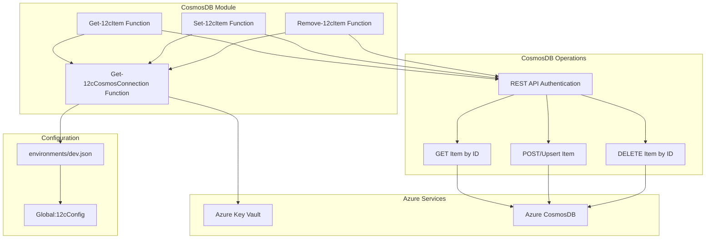

# CosmosDB Module Architecture

## Project Overview
The CosmosDB module provides Azure CosmosDB operations capabilities for OrchestratorPsh scripts and modules with secure connection management through Azure Key Vault.

## System Architecture
A PowerShell module that integrates with Azure CosmosDB using REST API calls, retrieves connection details from Azure Key Vault, and provides simplified item operations with built-in authentication and error handling.

## Technology Stack
- PowerShell 5.1+
- Azure CosmosDB REST API
- Azure Key Vault integration
- HMAC-SHA256 authentication
- JSON data serialization

## Modules and Components

- **Get-12cCosmosConnection**: Retrieves CosmosDB connection details from Azure Key Vault and returns connection configuration with database and container names.
- **Get-12cItem**: Fetches a specific item from CosmosDB by ID with optional partition key parameter and automatic authentication header generation.
- **Set-12cItem**: Upserts an item into CosmosDB with automatic JSON conversion and ensures required id property validation.
- **Remove-12cItem**: Deletes a specific item from CosmosDB by ID with optional partition key parameter and automatic authentication header generation.

## Connections & Accesses

- **Azure Key Vault** – *Secret Access*: Retrieves CosmosDB connection string stored as "CosmosDBConnectionString" secret.
- **Azure CosmosDB** – *REST API*: Direct HTTP calls to CosmosDB service endpoint using account key authentication.
- **Configuration Files** – *File System Access*: Reads connection details from local JSON files in the environments folder.

## Data Stores & Configurations

- **Azure CosmosDB**: Primary document database with configurable database and container names defaulting to "12cOrchestrator" and "Items".
- **Azure Key Vault Secrets**: Secure storage for CosmosDB connection string with automatic retrieval during operations.
- **environments/dev.json**: Configuration file containing CosmosDB account name and Key Vault details for environment-specific settings.

## Data Flow

Connection details are retrieved from Key Vault on first access, REST API calls are authenticated using HMAC-SHA256 signatures, and JSON data is serialized/deserialized for item operations.

## Security Considerations

Connection strings are stored securely in Azure Key Vault, REST API calls use signed authentication headers, and sensitive credentials never appear in logs or error messages during normal operation.