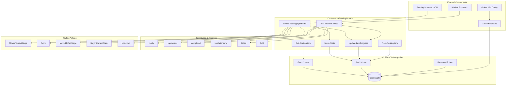

# OrchestratorRouting Module Architecture

## Project Overview
The OrchestratorRouting module provides routing logic for item processing workflows with built-in progress tracking and retry handling capabilities, integrated with CosmosDB for persistent state management.

## System Architecture
A state-machine-based routing system that evaluates item progress against a configurable schema to determine next actions, supporting retry logic and failure handling with case-insensitive state management and CosmosDB persistence.

## Technology Stack
- PowerShell 5.1+
- Azure CosmosDB (Document Database)
- Azure Key Vault (Connection String Management)
- JSON schema parsing and validation
- State machine pattern implementation
- Case-insensitive string handling
- RESTful API integration with CosmosDB

## Modules and Components

- **Invoke-RoutingBySchema**: Main routing engine that processes items based on current state and progress against the routing schema to determine next actions and persists changes to CosmosDB.
- **Move-State**: State transition function that updates only the State property of items in CosmosDB and is exclusively called by the routing logic.
- **Update-ItemProgress**: Progress update function that modifies only the Progress property in CosmosDB without touching State or RetryCount.
- **Test-WorkerService**: Example worker implementation that simulates item processing and updates progress to completed or failed states in CosmosDB.
- **Get-RoutingItem**: Item retrieval function that fetches items from CosmosDB by ItemId for continued processing.
- **New-RoutingItem**: Item creation utility that initializes new items with required properties and saves them to CosmosDB.

## Connections & Accesses

- **CosmosDB Connection** – *Azure Key Vault*: Retrieves secure connection strings for CosmosDB access from Azure Key Vault.
- **Global Configuration** – *Application Credentials*: Uses global 12c configuration for Azure Key Vault and CosmosDB account information.
- **JSON Routing Schema** – *File System Access*: Loads routing configuration defining state transitions, retry limits, and failure handling.
- **Azure REST API** – *HTTPS/TLS*: Communicates with CosmosDB through secure REST API endpoints for item operations.

## Data Stores & Configurations

- **CosmosDB Items Container**: Primary data store containing item documents with id, State, Progress, and RetryCount properties for persistent workflow state.
- **Azure Key Vault Secrets**: Secure storage for CosmosDB connection strings and authentication credentials accessed through global configuration.
- **Routing Schema JSON**: Configuration files containing state transition rules, retry limits, and failure stage definitions for workflow orchestration.
- **Global 12c Configuration**: Runtime configuration object containing Key Vault names and CosmosDB account information for service connections.

## Data Flow

Items are created and saved to CosmosDB with initial state and progress, processed by worker functions that update progress in CosmosDB, then evaluated by routing logic which determines state transitions based on schema rules and updates CosmosDB accordingly.

## Security Considerations

CosmosDB connections use secure connection strings from Azure Key Vault with proper authentication, and all item state changes are validated before persistence to maintain data integrity.