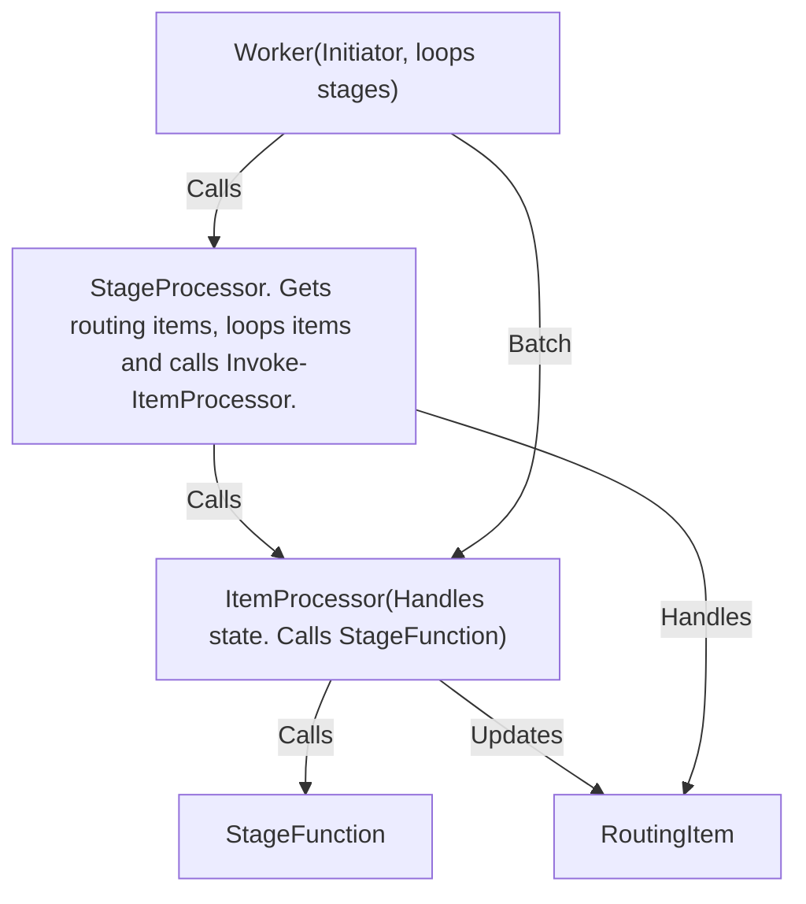

# Worker Module

A PowerShell module for batch processing of RoutingItems in specified workflow stages. This module leverages the OrchestratorRouting module for querying items from CosmosDB and updating their progress states.

## Prerequisites

- PowerShell 5.1 or later
- OrchestratorRouting module
- CosmosDB connectivity (for production use)

## Installation

The Worker module depends on the OrchestratorRouting module. Ensure OrchestratorRouting is available before importing Worker.

```powershell
Import-Module -Name "Path\To\Worker\Worker.psd1"
```

## Available Functions

### Core Worker Functions

- **`Invoke-TestTask`**: Simulates a task that sleeps for 1 second and throws an exception randomly in 50% of cases
- **`Invoke-ProcessTestTask`**: Processes all RoutingItems in state "TestTask" with progress "Ready"  
- **`Invoke-Worker`**: Generic worker that processes items in specified stages with configurable stage-to-function mapping

## Usage

### Basic Task Simulation

```powershell
# Simulate a task (50% chance of failure)
try {
    Invoke-TestTask
    Write-Host "Task completed successfully"
} catch {
    Write-Host "Task failed: $($_.Exception.Message)"
}
```

### Processing TestTask Items

```powershell
# Process all items in TestTask state with Ready progress
Invoke-ProcessTestTask
```

### Generic Worker Processing

```powershell
# Process items in multiple stages
$stages = @("Initialize", "SetReadOnly", "Upload")
Invoke-Worker -Stages $stages
```

## Stage Function Mapping

The `Invoke-Worker` function uses a configurable hashtable to map stages to processing functions. **All processing functions receive the RoutingItem as their first parameter by default.**

### Simple Function Mapping
```powershell
$stageFunctionMap = @{
    "Initialize" = "Invoke-Initialize"      # Function gets RoutingItem as parameter
    "SetReadOnly" = "Invoke-SetReadOnly"    # Function gets RoutingItem as parameter
    "Upload" = "Invoke-Upload"              # Function gets RoutingItem as parameter
    "TestTask" = "Invoke-TestTask"          # Function gets RoutingItem as parameter
}
```

### Advanced Function Mapping with Parameters
The stage mapping also supports scriptblocks for functions that need additional parameters:

```powershell
$stageFunctionMap = @{
    "Initialize" = "Invoke-Initialize"  # Simple function call
    "Upload" = { param($item) Invoke-Upload -Item $item -Timeout 300 -RetryCount 3 }  # Scriptblock with parameters
    "Backup" = { param($item) Invoke-Backup -Item $item -Location "AzureStorage" -Compress $true }
}
```

### Processing Function Requirements

Your processing functions should accept the RoutingItem as their first parameter:

```powershell
function Invoke-Initialize {
    param(
        [Parameter(Mandatory=$true)]$Item,
        [string]$Mode = "Default"
    )
    
    Write-Host "Processing item '$($Item.id)' in mode $Mode"
    # Your processing logic here
}

function Invoke-Upload {
    param(
        [Parameter(Mandatory=$true)]$Item,
        [int]$Timeout = 300,
        [int]$RetryCount = 3
    )
    
    Write-Host "Uploading item '$($Item.id)' with timeout $Timeout"
    # Your upload logic here
}
```

## Worker Function Dependencies

The Worker module supports importing external worker function modules automatically on module load. This enables modular development where worker functions can be implemented in separate files or modules.

- Worker function modules can be imported automatically by path or module name using `Get-WorkerFunctionModules` and `Import-WorkerFunctionModules`. 
- Each worker function (e.g., `Invoke-Initialize`) should be defined in its own file/module for modular development and easy extension.

## Worker stages

To extend the worker with new stages:
1. Add the stage-to-function mapping in the `$stageFunctionMap` hashtable
2. Ensure the corresponding processing function exists and accepts a RoutingItem parameter
3. Use scriptblocks if your function needs additional parameters

## Progress State Management

The Worker module follows the established pattern from OrchestratorRouting:

- **Ready**: Item is ready for processing
- **InProgress**: Item is currently being processed
- **Completed**: Item processing completed successfully
- **Failed**: Item processing failed

### Worker Processing Flow

For each item in each stage:
1. Set progress to `InProgress` using `Update-ItemProgress`
2. Call the corresponding processing function for that stage
3. On success: set progress to `Completed`
4. On failure: set progress to `Failed`

## Error Handling

- Worker functions handle individual item failures gracefully
- Failed items are marked with `Failed` progress state
- Processing continues with remaining items even if some fail
- Missing stage functions result in warnings and stage skipping
- Unmapped stages are skipped with warnings

## Testing

```powershell
# Run basic tests
& .\test-module.ps1

# Run integration tests (requires Azure connectivity)
& .\test-integration.ps1
```

The test suite includes:
- Random behavior testing for `Invoke-TestTask`
- End-to-end processing tests for `Invoke-ProcessTestTask`
- Multi-stage processing tests for `Invoke-Worker`
- Error handling and unmapped stage tests
- Progress filtering validation

### Integration Testing

The integration test (`test-integration.ps1`) validates the complete workflow:

1. **Creates test items** in Cosmos DB with "Ready" progress for each stage (Initialize, SetReadOnly, Upload)
2. **Invokes the Worker** to process the test items through all stages
3. **Verifies progress changes** from "Ready" to "Completed" or "Failed"
4. **Cleans up test items** from Cosmos DB

**Prerequisites for integration testing:**
- Valid Azure authentication (certificate-based)
- Access to CosmosDB instance with "OrchestratorDb" database
- All required modules (Configuration, OrchestratorAzure, CosmosDB, OrchestratorRouting)


## Integration Notes

- **OrchestratorRouting Dependency**: This module requires OrchestratorRouting for item querying and progress updates
- **CosmosDB Integration**: Item state persistence is handled through OrchestratorRouting's CosmosDB integration
- **Extensible Design**: Easy to add new stages and processing functions through the stage mapping hashtable

## Architecture


## System Architecture



- **Worker**: Orchestrates batch processing of RoutingItems across workflow stages.
- **StageProcessor**: Manages stage-to-function mapping and delegates item processing to the correct function.
- **StageFunction**: Implements the logic for a specific workflow stage, operating on a RoutingItem.
- **ItemProcessor**: Executes the processing logic for an individual RoutingItem and updates its progress state.
- **RoutingItem**: Represents an item to be processed, with state and progress properties.

The Worker module follows these key principles:

- **Separation of Concerns**: Only updates Progress, not State or RetryCount (handled by routing logic)
- **Configurable Mapping**: Stage-to-function mapping is easily extensible
- **Error Isolation**: Individual item failures don't stop batch processing
- **Consistent Patterns**: Follows established patterns from OrchestratorRouting module