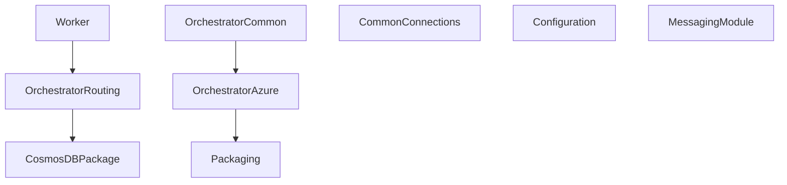

# Azure Infrastructure Deployment

## Prerequisites

### Install Bicep CLI
Bicep is required to deploy the Azure infrastructure in this project.
After installation, you may need to restart your terminal for the PATH to update. 

```powershell
winget install -e --id Microsoft.Bicep
# Verify installation
bicep --version
```

### Azure PowerShell Module
The Azure PowerShell module is required to interact with Azure resources programmatically, such as managing infrastructure and automating deployment tasks.
```powershell
# Install Azure PowerShell module if not already installed
if (-not (Get-Module -ListAvailable Az)) {
    Install-Module -Name Az -Scope CurrentUser -Repository PSGallery -Force
}
```

## Troubleshooting

### Update-12cModules.ps1 Issues

If you encounter "Unable to resolve package source" errors when running Update-12cModules.ps1 on a new machine, the script now includes automatic fixes for common portability issues:

**Automatic Fixes Included:**
- NuGet PackageProvider installation and updates
- PowerShell Gallery trust configuration
- Network connectivity testing to artifact feeds
- Proper credential handling for private repositories
- Enhanced error messages with troubleshooting guidance

**Manual Troubleshooting Steps:**
1. **Run as Administrator** - The script requires admin privileges for installing modules with `-Scope AllUsers`
2. **Check Network Connectivity** - Ensure the machine can reach `https://pkgs.dev.azure.com`
3. **Verify Azure Authentication** - Make sure the certificate is properly installed and Azure connection works
4. **Test Repository Access** - Try running: `Find-Module -Repository 'OrchestratorPshRepo22'`
5. **Check Event Logs** - Look for PowerShell and NuGet related errors in Windows Event Viewer

**For Testing Fixes:**
```powershell
# Run the test script to verify all components
.\CoreUpdaterPackage\test-module-update-fixes.ps1
```

## Scheduled Task Setup

The CoreUpdaterPackage includes scripts for automated execution via Windows Task Scheduler:

### Files Created
- `CoreUpdaterPackage\ScheduledTask\Update-12cModules.bat` - Batch script that executes Update-12cModules.ps1
- `CoreUpdaterPackage\ScheduledTask\Install-ScheduledTask.ps1` - PowerShell script to create scheduled task

### Installation
Run as Administrator:
```powershell
# Navigate to ScheduledTask directory
cd CoreUpdaterPackage\ScheduledTask

# Install the scheduled task (runs daily at 3:00 AM by default)
.\Install-ScheduledTask.ps1

# Optional: Customize schedule
.\Install-ScheduledTask.ps1 -TaskName "CustomUpdater" -TriggerType "Weekly" -TriggerTime "02:00"
```

### Management
```powershell
# View the task (located in "12c" folder in Task Scheduler)
Get-ScheduledTask -TaskName "Update-12cModules-Task" -TaskPath "\12c\"

# Run immediately for testing
Start-ScheduledTask -TaskName "Update-12cModules-Task" -TaskPath "\12c\"

# Remove the task
Unregister-ScheduledTask -TaskName "Update-12cModules-Task" -TaskPath "\12c\" -Confirm:$false
```

The scheduled task runs with SYSTEM account and highest privileges to ensure administrator access for module installation.

## Todo

Setup modules/configuration module same as messaging. 


4. **Develop Updater Script**
    - Authenticate with certificate.
    - Fetch secrets (PAT, package list).
    - Check latest versions in Azure DevOps feed.
    - Compare and install updates.

5. **Develop Build Script**
    - Package PowerShell modules into NuGet `.nupkg` files.
    - Automatically bump version based on `package.json`.
    - Delete old `.nupkg` files in the dist folder.

6. **Develop Publish Script**
    - Push `.nupkg` to Azure DevOps Artifacts using the PAT.

7. **Schedule Execution** ✓
    - Set up a Windows Task Scheduler or automation tool to run the updater regularly.
    - **Completed**: Created `Update-12cModules.bat` and `Install-ScheduledTask.ps1` for automated execution.

8. **Configure Local Module Installation Path**
    - Ensure consistent install location for updated modules.

9. **Logging and Error Handling**
    - Implement structured logging using PowerShell's built-in `Write-Information`, `Write-Warning`, and `Write-Error` cmdlets with transcript logging for file output and rotation.

10. **Validate and Test End-to-End Flow**
    - Manually test full process from secret retrieval to update to verify behavior:
        1. Retrieve secrets (PAT, package list) from Azure Key Vault.
        2. Authenticate using the certificate and ensure access to Azure resources.
        3. Check for the latest versions in the Azure DevOps feed.
        4. Compare and install updates as needed.
        5. Verify that logs capture all actions and errors, if any.


# Completed Tasks

1. **Store Secrets in Azure Key Vault**
    - Add the PAT and package list JSON as secrets.
    - Done.

2. **Create Azure AD App Registration**
    - Register an app and upload the certificate for authentication.
    - Done. AppId is found in environments/dev.json.

3. **Install Certificate on Target Machine**
    - Import the private key used for authentication.
    - Done. Storing certificate in Azure Key Vault. Installed on fm personal certs.

4. **Set up Modules/Configuration Module**
    - Created the NuGet package specification and build/publish scripts
    - Fixed module import and testing capabilities
    - Aligned module naming and directory structure
    - Added proper documentation for installation and usage
    - Implemented comprehensive test suite for module validation
    - Added Architecture.md with module design and usage documentation
    - Done.


## Module Dependency Overview



- **CommonConnections**: Standalone, provides connection config and caching.
- **Configuration**: Standalone, handles environment/module config.
- **Packaging**: Standalone, handles NuGet packaging and publishing.
- **OrchestratorAzure**: Core Azure logic, used by other modules.
- **OrchestratorCommon**: Loader, re-exports OrchestratorAzure functions.
- **CosmosDB**: Uses OrchestratorAzure and Configuration.
- **MessagingModule**: Uses OrchestratorAzure and Configuration.